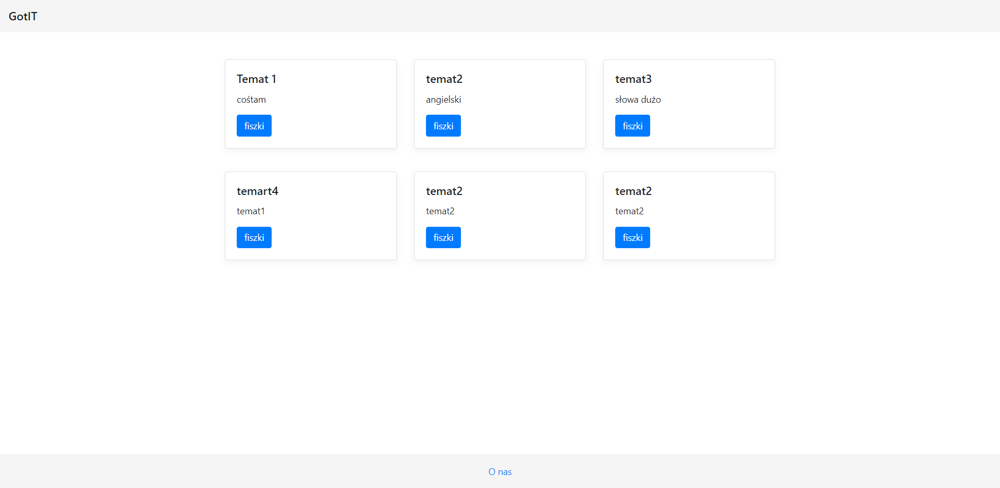

# Got IT
> Aplikacja do nauki z fiszkami. Stworzona za pomocą frameworka Angular. Aplikacja pobiera informacje z backendu Web Api C# z użyciem bazy danych sql i chmury Azure. 
## Spis treści
* [Informacje ogólne](#Informacje-ogólne)
* [Uruchamianie] (#Uruchamianie)
* [Dokumentacja](#dokumentacja)
* [Technologia](#Technologie)
* [Przykład kodu](#przykład-kodu)
* [Funkcjonalności](#Funkcjonalności)
* [Status](#status)
* [Kontakt](#kontakt)
## Informacje ogólne
Aplikacja jest przeznaczona dla osób chcących poszerzyć wiedzę z języka angielskiego, pojęć z zakresu IT w przyszłości zostanie rozbudowana o możliwość dodawania i edycji fiszek przez użytkownika.
##Uruchamianie
Uruchom aplikację za pomocą 'ng serve', przejdź pod adres `http://localhost:4200/` w swojej przeglądarce.
## Dokumentacja


## Technologie
* Angular 12.0.0.
## Przykład kodu
* Pobieranie danych:
```ruby
url = 'http://flashcardsdj.azurewebsites.net/api/Flashcard/GetList';

  FlashcardsAngular: any=[];
  
  constructor(private http: HttpClient){
  }

  ngOnInit(){
    this.FlashcardsAngular = this.http.get(this.url)
      .subscribe(data=>{
        this.FlashcardsAngular=data;
      })
    return this.FlashcardsAngular;
  }
```
* Wyświetlanie fiszek:
```ruby
  <div class="d-flex justify-content-center" style="margin-top: 80px;">
      <div>
        <div class="d-flex justify-content-center"><h3 id="category">{{FlashcardsAngular[0].Category}}</h3></div>
      <div class="card" style="width:400px; min-height: 250px;">
        <div class="card-body" style="visibility: visible;" id="card">
          <p>Pytanie nr <a id="id">{{FlashcardsAngular[0].Id}}</a></p>
          <h5 id="question" class="card-title">{{FlashcardsAngular[0].Question}}</h5>
          
          <button (click)="showAnswer()" class="btn btn-primary" >Pokaż odpowiedź</button>

          <p class="card-text" style="visibility:hidden;" id="answer">{{FlashcardsAngular[0].Answer}}</p>

        </div>
      </div>
      <div class="d-flex justify-content-center" style="margin-top: 10px;" id="buttons">
          <button (click) ="remember()" type="button" class="btn btn-success" style="margin-right: 30px; width:150px;">Zapamiętane</button>
          <button (click) ="nextQuestion()" type="button" class="btn btn-danger" style="width: 150px;">Na później</button>
          
      </div>
      <div class="justify-content-center" style="text-align: center; visibility: hidden;" id="win">
      <hr />
          <p>Gratulacje! materiał opanowany!</p>
        </div>
    </div>
  </div>
```
## Funkcjonalności
* Applikacja umożliwia wyświetlanie fiszek z bazy danych.
* Aplikacja umożliwia wybór kategorii - funkcja w trakcie wdrażania.
* Aplikacja umożliwia wyświetlenie właściwej odpowiedzi.
* Aplikacja umożliwia ukrycie fiszki po naciśnięciu przycisku "Zapamiętane".
* Aplikacja wyświetla kolejną fiszkę po naciśnięciu przycisku "Na później".
* wyswietlenie pogody dla wprowadzonego miasta
## Kontakt
Aplikację stworzył:
Damian Jaszewski @damianjaszewski@gmail.com
